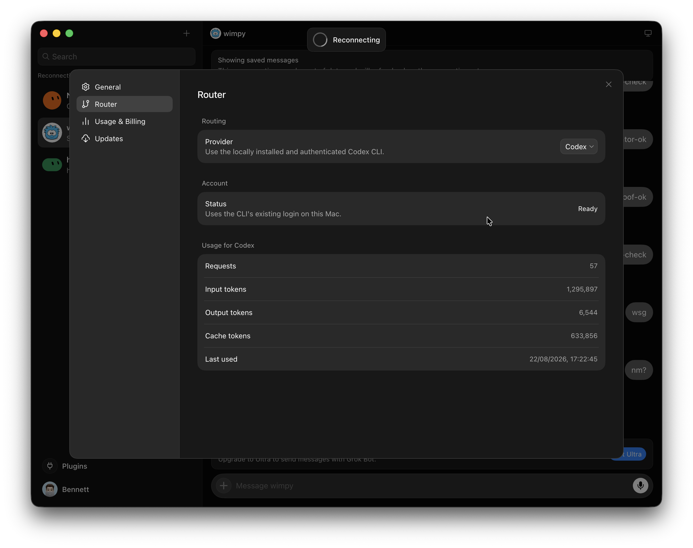

# Grok Bot 0.18 — reconstructed and extended



This repository is an unofficial, source-oriented reconstruction of the
publicly shipped Grok Bot 0.18.0 macOS app.

The project began as an attempt to understand how the desktop app was put
together. It now contains readable TypeScript implementations of its Electron,
host, coordinator, local-execution, protocol, and renderer boundaries, plus a
deterministic toolchain for turning those sources back into a working macOS
application.

It also adds a few practical experiments:

- an inference router for Cursor Agent, Claude Code, Codex, OpenCode, and OpenRouter;
- Grok Bot plugin/MCP tools across the routed providers;
- local usage tracking for routed inference;
- an optional local Docker sandbox in place of the remote box; and
- a reconstructed settings surface integrated into the polished shipped UI.

This is a hacking and research project, not Anysphere's original monorepo and
not an official Grok Bot release. Names and module boundaries inferred from a
compiled application may differ from the original source.

## What is in the repository?

The checked-in tree contains the reviewed reconstruction, tests, manifests,
build scripts, and Git LFS preservation copies of the original macOS arm64 and
Windows x64 installers. It deliberately does **not** commit the extracted
upstream application, build output, local credentials, or the large forensic
recovery workspace.

The public Grok Bot 0.18.0 application is instead treated as a pinned build
input. During bootstrap, the toolchain downloads it, verifies its SHA-256
identity, and extracts the pieces required to assemble the reconstruction.

The repository exposes two deterministic runtime profiles:

- the default release compiles the Electron, host, and Renderer runtimes from
  `source/` and `frontend/src`;
- the explicit fidelity profile keeps the checksum-pinned shipped Renderer only
  for byte-level comparison;
- both profiles record their composition, input graph, and output hashes; and
- every finished app uses a separate bundle identifier and an ad-hoc signature.

The upstream app installed on the machine is never overwritten.

### Why keep a fidelity profile?

The distributed application did not include the original frontend source or
source maps. It contained optimized, minified production JavaScript and CSS
chunks: enough to inspect behavior and recover contracts, but not the authored
React components, names, comments, file structure, or design-system source.

The distributed application did not include the authored frontend source or
source maps. The clean `frontend/src` tree is therefore an evidence-backed
TypeScript reconstruction, not a claim of recovered original files. The fidelity
profile remains available because byte identity is useful when comparing against
the shipped release; it is never selected implicitly. The source profile is the
editable engineering path and is guarded by the renderer closure and UI
provenance audits.

## Preserved original installers

Research copies of the exact 0.18.0 installers live under
`research-archives/original/0.18.0/` and are stored with Git LFS:

| Platform | File | SHA-256 |
| --- | --- | --- |
| macOS arm64 | `macos-arm64/Grok_Bot_0.18.0.dmg` | `a253ccd8aab01e083f9812a0264354c5034d8ba7f0610bbb557e82ae77d203eb` |
| Windows x64 | `windows-x64/Grok_Bot_0.18.0_Setup.exe` | `464079a15ef5fa8b61ccea8fffcc78f63cfcf6df65fb0ad5e725d8b95f7e437e` |

See [research-archives/README.md](research-archives/README.md) for source URLs,
sizes, verification commands, and the machine-readable artifact manifest.

## Current features

### Inference Router

Open **Settings → Router** to choose the backend used for new turns:

| Provider | Authentication | Tool support |
| --- | --- | --- |
| Cursor Agent CLI | Existing local Cursor Agent CLI login | Routed Grok Bot MCP tools |
| Claude Code | Existing Claude Code login | Routed Grok Bot MCP tools |
| Codex | Existing local ChatGPT/Codex login | Direct Responses transport with Grok Bot tools; optional CLI-MCP compatibility mode |
| OpenCode | Existing local OpenCode provider credentials | OpenCode CLI with routed Grok Bot MCP tools |
| OpenRouter | API key saved through the desktop secrets bridge | Grok Bot tool-execution loop |

Cursor Agent CLI is the default. Claude Code and Codex do not require separate
API keys when their local clients are already authenticated. The application preserves
streaming responses, thinking state, reactions, rich plugin mentions, and MCP
tool execution across routed conversations.

**Usage & Billing** shows the locally recorded request and token totals for
providers that return usage data. These figures are activity records, not an
authoritative provider invoice.

The reconstructed app uses the local Cursor Agent CLI by default. It does not
open a Cursor website login; the CLI's existing `cursor-agent login` session is
used for new turns. Set `SAND_INFERENCE_PROVIDER=codex`, `claude-code`,
`opencode`, or `openrouter` to force another route. In the UI, **Settings →
Router** persists the selected provider and model in the main settings store;
the UI choice is not a browser-local preference and works the same in the
development and packaged apps. Local CLI providers use the local Docker VM by
default and still require their own credentials: Claude Code login, Codex
ChatGPT login, OpenCode provider credentials, or an OpenRouter API key saved in
**Settings → Router**.
Codex uses the direct Responses transport by default to avoid starting a new
CLI process for every turn. Set `SAND_CODEX_MCP_MODE=cli` only when the CLI-MCP
compatibility path is required. Routed Codex turns use `medium` reasoning by
default so the desktop assistant does not inherit a slow `xhigh` setting from
the user's interactive Codex CLI; set `SAND_CODEX_REASONING_EFFORT` explicitly
when a different effort is needed. Set `SAND_INFERENCE_DEBUG=1` to print
provider, roster, tool-catalog, tool, and turn timings without logging prompts
or tool arguments. Direct requests fail with a clear timeout after 60 seconds
by default; `SAND_CODEX_DIRECT_TIMEOUT_MS` can override that bound when a slower
connector is intentional. In `npm run dev`, the timing file is written to
`.cache/dev-profile/inference-debug.log` when debug mode is enabled; packaged
launches can set `SAND_INFERENCE_DEBUG_FILE` to an absolute path.
Claude Code turns use two API retries and a 60-second response bound by default;
`SAND_CLAUDE_MAX_RETRIES` and `SAND_CLAUDE_TIMEOUT_MS` can override those limits.
Computer startup is asynchronous: the shell is released after a 2.5-second
startup budget while the local or remote computer continues connecting in the
background. Computer-only actions remain unavailable until that connection is
ready and can be retried from the reconnect surface.

### Local Docker sandbox

The Router page also has a **Use local Docker VM** toggle. When enabled, Grok
Bot runs its box host and execution daemon in an owned local container instead
of connecting to the remote sandbox.

The container:

- is bound only to loopback ports;
- mounts content-addressed host and daemon artifacts read-only;
- reuses the user's existing provider authentication where needed;
- is validated before the coordinator connects; and
- is stopped or replaced through the same settings lifecycle.

Docker Desktop, or another compatible local Docker daemon, must be running.
Remote mode remains the default.

## Requirements

- macOS on Apple Silicon
- Node.js 26.5.x
- Xcode Command Line Tools
- Git LFS
- Docker Desktop (optional, only for the local sandbox)
- local Cursor Agent, Claude Code, Codex, or OpenCode authentication for those router choices

## Quick start

```sh
git clone <your-repository-url>
cd grok-bot-0.18-reconstructed
git lfs install
git lfs pull
npm ci
npm run bootstrap
npm run check
npm run package
open "dist/Grok Bot 0.18 Reconstructed.app"
```

`npm run bootstrap` first uses the Git LFS preservation copy of the pinned
0.18.0 DMG. If that archive is absent, it falls back to the original public URL;
`GROK_BOT_018_APP` can also point to an existing application copy. Bootstrap
verifies both the DMG and `app.asar`, caches the matching Electron runtime, and
hydrates the ignored `src/app/dist` build input.

`npm run package` compiles the reconstructed Electron, host, and Renderer
runtimes from TypeScript, creates the app bundle, assigns the reconstructed
bundle identity, ad-hoc signs it, and verifies the result. Output is written to:

```text
dist/Grok Bot 0.18 Reconstructed.app
```

Reconstructed packages disable the upstream updater at the packaging boundary
and default upstream Sentry and telemetry emission off. Explicitly supplied
environment configuration is still respected.

The same clean graph is available explicitly through `npm run build:source`,
`npm run package:source`, or `npm run dev -- --renderer source`. Use
`npm run build:fidelity`, `npm run package:fidelity`, or
`npm run dev -- --renderer upstream` only for the byte-exact Renderer comparison
path.

## Architecture

```text
polished shipped renderer
          │
          │ desktop preload / RPC
          ▼
     Electron main
          │
          ├── settings, secrets, auth and plugin lifecycle
          ├── remote box connector
          └── owned local Docker connector
                       │
                       ▼
              coordinator + host
                       │
              inference router
           ┌───────────┼───────────┐
        Cursor      Claude       Codex / OpenRouter
                       │
                 Grok Bot MCP tools
```

The main source areas are:

- `source/electron-main/` — desktop lifecycle, settings, auth, box connectors,
  coordinator ownership, and RPC handlers;
- `source/electron-preload/` — the narrow trusted bridge exposed to the UI;
- `source/host/` — inference, tools, MCP, settings, and turn execution;
- `source/node-agent-coordinator/` — transcript routing, streaming activity,
  reactions, and the routed MCP bridge;
- `source/shared/` — shared contracts, settings, protocol, and provider helpers;
- `frontend/` — readable React/TypeScript renderer reconstruction and design
  workspace;
- `scripts/` — bootstrap, compilation, renderer patching, packaging, signing,
  and verification; and
- `tests/` — publication and router regressions.

The default product renderer is the clean `frontend/src/main.tsx` graph. The
checksum-pinned 0.18 renderer under `src/app/dist/renderer` remains the
pixel-fidelity authority for explicit comparison. For forensic inspection,
`npm run frontend:recover` expands the exact shipped bundle into
`recovered/frontend/app`; `npm run dev -- --renderer recovered` serves that
snapshot through Vite. The original package does not contain the upstream
TypeScript/JSX sources, so `frontend/src` remains an evidence-backed
reconstruction rather than a claim of original authorship.

See [docs/ARCHITECTURE.md](docs/ARCHITECTURE.md) for more detail.

## Development commands

```sh
npm run dev -- --provider cursor # Vite + unpackaged Electron; uses cursor-agent
npm test                  # focused regression tests
npm run typecheck         # renderer TypeScript
npm run source:typecheck  # runtime TypeScript
npm run frontend:build    # build the audited semantic renderer reconstruction
npm run package           # build, sign, and verify the macOS app
npm run package:source    # package the clean TypeScript Renderer profile
npm run package:fidelity  # package the checksum-pinned Renderer profile
npm run verify            # verify an existing packaged app
npm run smoke             # bounded native smoke check
npm run publication:check # prove a fresh-history export is lossless
```

`npm run dev` launches Electron against an unpackaged development app directory
using the same clean-source graph as the default packaged app. Pass
`--renderer upstream` to run the checksum-pinned release Renderer, or
`--renderer recovered` to serve the expanded shipped snapshot through Vite. The
source renderer and `npm run package:source` share the same clean runtime graph;
the recovered renderer is generated from the pinned bundle immediately before
launch. The command does not create, sign, or install a macOS `.app`. The default provider is `cursor` and
uses the local Cursor Agent CLI; choose `--provider codex`, `claude-code`,
`opencode`, or `openrouter` when needed. External
providers use the local Docker VM by default and still require their own local
login or API key. Development runs use `.cache/dev-profile` by default, while a
packaged app uses macOS's normal `Grok Bot` user-data directory. To inspect the
same bots in both modes, pass the same absolute path with `--user-data-dir` to
the development command and `--user-data-dir` when launching the packaged app.
Use `--no-build` to reuse the last generated runtime. Vite, control, and CDP
ports are selected from free loopback ports at startup; the chosen values are
printed when a requested port is already busy.

Generated directories including `.cache`, `.build`, `dist`, `src/app/dist`,
`recovered`, `recovery`, and local probe roots are ignored.

## Project status

The app launches and the core reconstructed flows are usable, including routed
inference, connected plugins, and the local Docker sandbox. This is still an
experimental reconstruction: it targets one pinned macOS/arm64 release, depends
on external provider sessions, and does not promise compatibility with future
Grok Bot versions.

For changes, read [CONTRIBUTING.md](CONTRIBUTING.md). For the clean-history
export procedure, see [docs/PUBLISHING.md](docs/PUBLISHING.md). Technical
provenance and retained upstream boundaries are described in
[PROVENANCE.md](PROVENANCE.md) and [NOTICE.md](NOTICE.md).
